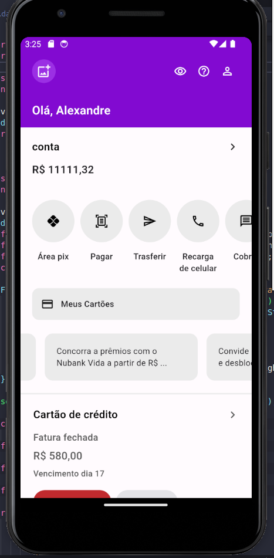

# Nubank UI clone in Flutter

This project, is an actvity for my Mobile Systems class. 
The main idea here is to understand, a little bit, how a flutter project works by practicing.

All the code was created using with this tutorial:

